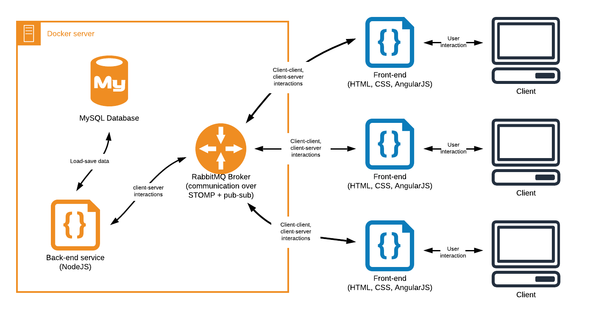
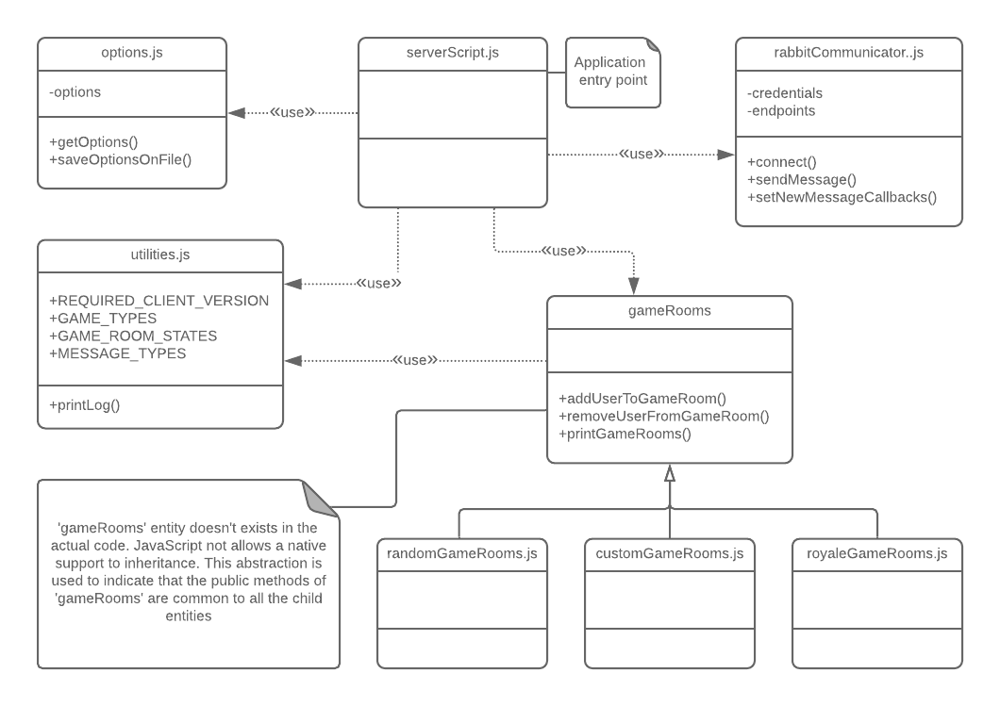

# CodyColor back-end service

[CodyColor Multiplayer](https://codycolor.codemooc.net/#!/) is an educational game developed by Digit S.r.l., inspired by the unplugged coding method **CodyColor**. Additional information about the game can be found in the [Digit blog](https://digit.srl/codycolor-multiplayer-learn-by-having-fun/). The software infrastructure on which the game is based is based on two main components:

* the **back-end**, composed by a message broker and a NodeJS executable; all the back-end code is contained and handled in a Docker infrastructure;
* the **front-end**, composed by [a web app](https://github.com/digit-srl/CodyColorClient) developed on the AngularJS framework.



This repository includes all the files that form the back-end system of the game.


## How to make it run

Configuration details in `config.env` file.
Outside communication (HTTP proxy) relies on Traefik working with automatic Docker setup. See details in `docker/docker-compose.yml`.

Start the system with:
```bash
make up
```

## NodeJS code organization

Referring to the NodeJS executable, it is possible to visualize relations between the various modules using the following class diagram. 



It is important to underline that the code is not divided in class (even because JavaScript does not completely support OOP), and the diagram does not reports all methods and attributes contained in the modules. Nevertheless, the diagram is very useful to understand the dependencies between the various modules, and to know how the various featues are organized inside the script.
